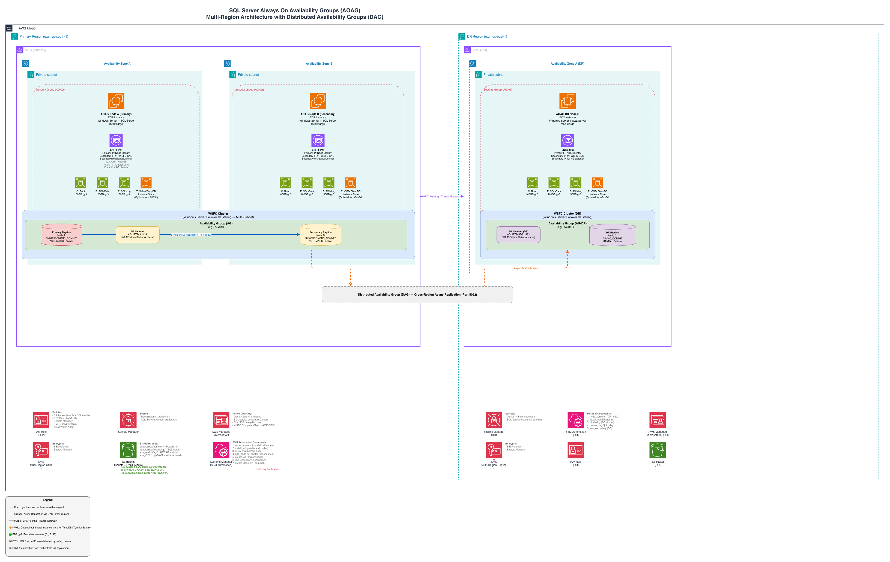

# terraform-aws-aoag

[](https://github.com/aws/mit-0)
[](https://www.terraform.io/)
[](https://registry.terraform.io/providers/hashicorp/aws/latest)

🚀 Deploy SQL Server Always On Availability Groups (AOAG) on Amazon Elastic Compute Cloud (EC2) with automated AWS Systems Manager (SSM)-driven configuration. Supports multi-Availability Zone (AZ) high availability (HA), cross-region disaster recovery (DR) via Distributed Availability Groups (DAG), Bring Your Own License (BYOL) and license-included Amazon Machine Images (AMIs), and optional NVMe instance store for TempDB.

🌎 Open-source asset published at [aws-samples](https://github.com/aws-samples) GitHub

Single-apply deployment using PowerShell scripts orchestrated by AWS Systems Manager.

✨ Key features:

- **Multi-AZ High Availability** — 2+ node AOAG cluster with synchronous replication and automatic failover via Windows Server Failover Clustering (WSFC)
- **Cross-Region DR via DAG** — Distributed Availability Groups for asynchronous cross-region replication
- **Single-Apply Deployment** — One `terraform apply` provisions SSM docs, EC2 nodes, AWS Identity and Access Management (IAM), and AWS Key Management Service (KMS) keys
- **BYOL Support** — Auto-detects SQL Server setup media in Amazon S3 for license-optimized deployments
- **NVMe TempDB** — Optional NVMe instance store for low-latency TempDB on m5d/r5d/r6id/i3 types
- **Encryption Everywhere** — Customer-managed multi-region KMS keys, AWS Secrets Manager, IMDSv2 required
- **Flexible Topologies** — HA + DR with DAG, HA only, or single-node dev/test

See the [Security](#️-security) section below before deployment.

## Contents

- [🏗️ Architecture](#️-architecture)
- [📋 Use Cases](#-use-cases)
- [🔧 Deployment](#-deployment)
  - [1. Prerequisites](#1-prerequisites)
  - [2. Clone and Configure](#2-clone-and-configure)
  - [3. Deploy Infrastructure](#3-deploy-infrastructure)
  - [4. SSM Automation Executes](#4-ssm-automation-executes)
  - [5. Verify](#5-verify)
- [💻 Usage](#-usage)
  - [Deployment Scenarios](#deployment-scenarios)
  - [Key Variables](#key-variables)
  - [SQL Server Licensing](#sql-server-licensing)
  - [NVMe Instance Store for TempDB](#nvme-instance-store-for-tempdb)
  - [DAG Failover / Failback](#dag-failover--failback)
  - [SSMS Offline Install](#ssms-offline-install)
- [🛠️ Day-2 Operations](#️-day-2-operations)
  - [Add a Database to the AG](#add-a-database-to-the-ag)
  - [Create or Join a DAG with a Specific Seeding Mode](#create-or-join-a-dag-with-a-specific-seeding-mode)
  - [Seeding Mode Guidance](#seeding-mode-guidance)
  - [Migration / Extension Use Cases](#migration--extension-use-cases)
- [📁 Project Structure](#-project-structure)
- [📖 Documentation](#-documentation)
- [🧹 Cleanup](#-cleanup)
- [🤝 Contributing](#-contributing)
- [🔒️ Security](#️-security)
- [📝 License](#-license)

## 🏗️ Architecture



## 📋 Use Cases

### Multi-AZ High Availability
Deploy a multi-node AOAG cluster across Availability Zones with synchronous replication and automatic failover. Suitable for workloads that require high availability with zero data loss within a region.

### Cross-Region Disaster Recovery via DAG
Extend the primary AOAG with a DR node in a separate AWS region using Distributed Availability Groups. Asynchronous replication across regions with manual failover for disaster recovery scenarios.

### Dev/Test Environments
Deploy a single standalone SQL Server instance (set `is_ha = false`, `deploy_dr = false`) for development or testing that mirrors the same configuration without HA overhead.

### On-Premises SQL Server Migration to AWS
Use this module as the landing zone for migrating on-premises SQL Server clusters to AWS. The DAG capability enables near-zero-downtime migration:
1. Deploy the AWS AOAG cluster
2. Create a DAG linking on-premises AG (primary) to AWS AG (secondary)
3. Let DAG synchronize all databases
4. Cutover: fail over DAG to AWS, promote AWS AG to primary
5. Decommission on-premises

Requires Direct Connect or VPN and SQL Server 2016 SP1+ on-premises.

### BYOL License Optimization
Bring existing SQL Server licenses to AWS using plain Windows Server AMIs. Place SQL Server setup media in S3 — the automation auto-detects and installs it. No license-included AMI cost.

### Regulated Workloads
All EBS volumes encrypted with customer-managed KMS keys. Secrets Manager for all credentials. Scoped IAM policies with no wildcard resources. IMDSv2 required. Suitable for HIPAA, PCI-DSS, SOX compliance requirements.

## 🔧 Deployment

### Supported Versions

| Component | Version |
|---|---|
| Terraform | >= 1.8.2 |
| AWS Provider | ~> 5.70 |
| Windows Server | 2022 / 2025 Datacenter |
| SQL Server | 2019 / 2022 / 2025 |
| PowerShell | 5.1 (built-in) |

### 1. Prerequisites

- Active Directory (AD) domain with DNS. Instances must resolve the domain at the VPC level — via the DHCP option set or a Route 53 Resolver forwarding rule. The automation sets the DNS suffix search list, not the NIC's DNS servers.
- An AD service account with permissions to join computers to the domain (used as `domain_join_user`)
- The cluster's CNO must be able to create computer objects, or the AG listener will fail — see [Active Directory permissions and the AG listener](#active-directory-permissions-and-the-ag-listener)
- A SQL Server service account in AD (used as `sql_service_account`) for running SQL Server services
- Virtual Private Cloud (VPC) with subnets in multiple Availability Zones
- Cross-region network connectivity via AWS Transit Gateway (TGW) or VPC Peering if deploying DR with DAG
- AMI for EC2 instances — choose one of:
  - **License-included AMI**: AWS-provided Windows Server AMI with SQL Server Enterprise pre-installed. SQL binaries are already on the AMI. Use the latest AMI ID available in your deployment region (search for "Windows_Server-2022-English-Full-SQL_2022_Enterprise" in the EC2 console or via `aws ec2 describe-images`).
  - **BYOL AMI**: Plain Windows Server AMI (no SQL Server). Upload your SQL Server setup media zip to the S3 bucket under the `aoag/` prefix (e.g., `aoag/SQL2025-Enterprise.zip`). The SSM automation auto-detects and extracts it during provisioning.
- S3 bucket for automation scripts (uploaded automatically by Terraform). The bucket must already exist and `bucket_region` must match the bucket's actual AWS region.
- Secrets Manager secrets for the domain-join and SQL service accounts. Values must be JSON — `{"username":"...","password":"..."}` — not a bare password string. `domain_join_user` must match the `username` in the secret.
- The module **creates and manages** the security group required for the cluster. You don't need to pre-create one. The module-managed SG includes all inbound rules for WSFC, SMB, the database mirroring endpoint, RPC, and dynamic ports, and an all-outbound egress rule so each EC2 instance can reach AWS service endpoints (Systems Manager, S3, KMS, Secrets Manager) and Active Directory. To layer additional rules (for example, RDP from a bastion), pass an extra security group ID via `ec2_security_group_ids` and it will be attached alongside the module-managed SG. The full rule set the module installs:

  | Port | Protocol | Purpose |
  |---|---|---|
  | 1433 (or custom TCPPORT) | TCP | SQL Server instance + AG Listener |
  | 5022 | TCP | Database mirroring endpoint (AG + DAG replication) |
  | 135 | TCP | RPC Endpoint Mapper (WSFC) |
  | 3343 | TCP/UDP | WSFC cluster communication |
  | 445 | TCP | SMB (file sharing, WSFC) |
  | 137 | UDP | NetBIOS name service (WSFC) |
  | 5985-5986 | TCP | WinRM (SSM remote execution) |
  | 49152-65535 | TCP/UDP | Dynamic ports for cluster RPC |
  | ICMP | — | WSFC heartbeat |

- Terraform >= 1.8.2 with AWS CLI

### 2. Clone and Configure

```bash
git clone <repository-url>
cd terraform-aws-aoag
cp example.auto.tfvars terraform.auto.tfvars
```

Edit `terraform.auto.tfvars` with your actual values. See the [Example Configuration](#example-configuration) section below.

### 3. Deploy Infrastructure

```bash
terraform init
terraform plan
terraform apply
```

This creates all infrastructure: SSM documents, EC2 instances with encrypted EBS, ENIs, IAM roles, KMS keys, and S3 script uploads.

### 4. SSM Automation Executes

With `run_ssm_associations = true`, SSM documents execute in dependency order:

1. `node_common` — Downloads scripts, initializes volumes, installs prerequisites, joins domain
2. `install_sql` — Installs SQL Server standalone instance on each node
3. `clustering` — Creates WSFC cluster on primary node
4. `add_node_to_cluster` — Joins secondary nodes to the cluster
5. `create_availability_group` — Creates AG with listener on primary
6. `join_secondary` — Joins secondary replicas to the AG
7. `create_dag` / `join_dag` — Sets up Distributed AG for cross-region DR (if enabled)
8. `test_failover` — Validates AG and DAG failover/failback

### 5. Verify

Monitor SSM Automation executions in the AWS Console under Systems Manager > Automation. Each SSM association has an 8000-second (\~2.2 hour) timeout. A full 2-node HA deployment typically completes in 45–90 minutes depending on instance type and network speed.

Once complete, connect to the AG listener endpoint on the configured TCP port.

> **Note:** Each EC2 node is provisioned with a single ENI containing at least 3 private IP addresses: the primary IP (node identity), a secondary IP for the WSFC Cluster Name Object (CNO), and a secondary IP for the AG Listener. The number of secondary IPs comes from `private_ips_count` in `instances_data_map` and defaults to 2. Values below 2 are rejected at plan time, because the CNO and the AG Listener are taken from secondary IP index 0 and index 1 respectively — with only one secondary IP they would collide on the same address.

### Active Directory permissions and the AG listener

The AG listener's computer object (VCO) is created by the **cluster identity**
(the CNO computer account, e.g. `MYCLUSTER$`) — not by the credentials the module
runs as. If the CNO can't create computer objects, listener creation fails with
`Msg 19471` and FailoverClustering **event 1194** (`Access is denied`) in the
node's System log. Everything before it succeeds, so it looks unrelated to AD.

Unhardened domains hide this: `Authenticated Users` holds *Add workstations to a
domain* and the CNO self-services the object. It surfaces on AWS Managed
Microsoft AD, and on any domain with `ms-DS-MachineAccountQuota = 0`.

The `create_availability_group` document handles it with a `PrestageListenerVCO`
step ([`Prestage-AGListenerVCO.ps1`](module/ec2_sql_aoag/scripts/ag/Prestage-AGListenerVCO.ps1)):
it creates the VCO as a disabled computer object next to the CNO and grants the
CNO Full Control on it, so no OU-level delegation is needed. The step is
idempotent and adopts an existing VCO.

Alternatively, grant the CNO the permission directly (per-cluster, since the ACE
is bound to its SID):

```powershell
dsacls "OU=Computers,OU=example,DC=example,DC=com" /G "EXAMPLE\MYCLUSTER$:CC;computer"
```

See [Prestage cluster computer objects in AD DS](https://learn.microsoft.com/en-us/windows-server/failover-clustering/prestage-cluster-adds).

### Redeploying with the same names

`terraform destroy` does not remove AD objects or DNS records. Node computer
accounts, the CNO, and the listener VCO all survive, along with their A records.
Since hostnames come from the `instances_data_map` keys, a redeploy reuses them
and fails in one of two ways:

- **Domain join** fails with `The account already exists` (stale computer account).
- **Cluster creation** fails with `An enabled computer account (object) for
  '<name>' was found`, or the node join fails with `Check the spelling of the
  cluster name. Otherwise, there might be a problem with your network` — the
  latter is usually a stale **DNS A record** pointing the cluster name at an IP
  from the previous deployment, not a network fault.

Delete the stale objects before redeploying, or use new names. Note the CNO is
named after `namespace`, not `clustername`, and the DR cluster is
`<namespace>-dr`. So for `namespace = "aoag01"` the objects to remove are:

```powershell
# computer accounts: nodes, CNOs, listener VCOs
'AWSAOAG01A','AWSAOAG01B','aoag01','aoag01-dr','AGLIST01','AGLIST01DR' |
    ForEach-Object { Remove-ADComputer -Identity $_ -Confirm:$false -ErrorAction SilentlyContinue }

# matching DNS records (stale A records cause the "spelling of the cluster name" error)
'AWSAOAG01A','AWSAOAG01B','aoag01','aoag01-dr','AGLIST01','AGLIST01DR' |
    ForEach-Object { Remove-DnsServerResourceRecord -ZoneName '<domain>' -RRType A -Name $_ -Force -ErrorAction SilentlyContinue }
```

A cluster CNO carries deletion protection, so `Remove-ADObject -Recursive` can
return `Access is denied`; `Remove-ADComputer` handles it.

## 💻 Usage

### Deployment Scenarios

**Scenario 1: Multi-AZ HA (Primary Site Only)**

2+ nodes in a single region with synchronous replication and automatic failover.

```hcl
is_ha      = true
deploy_dr  = false
dag_name   = ""
```

**Scenario 2: Multi-AZ HA + Cross-Region DR via DAG**

Primary HA cluster + DR node in a separate region linked via Distributed Availability Group.

```hcl
is_ha                      = true
deploy_dr                  = true
dag_name                   = "mydag"
dr_cluster_name            = "mycluster-dr"
dr_availability_group_name = "myag-dr"
dr_listener_name           = "mylistener-dr"
```

**Scenario 3: On-Premises Extension via DAG**

Extend an existing on-premises AG to AWS using a Distributed Availability Group. Terraform deploys only the AWS DR side; the on-prem primary creates the DAG.

```hcl
is_ha                      = false
deploy_dr                  = true
dag_name                   = "mydag-onprem"
dr_cluster_name            = "aws-dr-cluster"
dr_availability_group_name = "myag-aws-dr"
dr_listener_name           = "mylistener-aws-dr"
```

After Terraform deploys the AWS side, run `Create-DAG.ps1 -Action Create` on the on-premises primary to establish the DAG link. See [AOAG_DEPLOYMENT_WORKFLOW.md](AOAG_DEPLOYMENT_WORKFLOW.md) for details.

**Scenario 4: Single Node (Dev/Test)**

Standalone SQL instance with no HA or DR.

```hcl
is_ha     = false
deploy_dr = false
dag_name  = ""
```

### Example Configuration

<details>
<summary>Click to expand example.auto.tfvars</summary>

```hcl
namespace          = "aoag01"
aws_region_primary = "us-east-1"
sync_replica_count = 1

instances_data_map = {
  "YOURAOAG01A" = {
    ami_id            = "ami-0123456789abcdef0"  # Windows + SQL Enterprise, or plain Windows for BYOL
    instance_type     = "m5d.xlarge"
    availability_zone = "us-east-1a"
    subnet_id         = "subnet-0123456789abcdef0"
    iam_instance_profile   = ""
    platform               = "windows"
    key_name               = "your-key-pair"
    user_data              = ""
    vpc_security_group_ids = ["sg-0123456789abcdef0"]
    private_ips_count      = 2
    root_block_device = { volume_size = 100, volume_type = "gp3", volume_iops = 3000 }
    ebs_block_device = [
      { volume_size = 100, volume_type = "gp3", volume_iops = 3000, device_name = "xvdf",
        mount_name = "SQL-Data", drive_letter = "E", label_name = "SQL-Data", block_size = 65536 },
      { volume_size = 50, volume_type = "gp3", volume_iops = 3000, device_name = "xvdg",
        mount_name = "SQL-Log", drive_letter = "F", label_name = "SQL-Log", block_size = 65536 },
      { volume_size = 100, volume_type = "gp3", volume_iops = 3000, device_name = "xvdh",
        mount_name = "SQL-TempDB", drive_letter = "T", label_name = "SQL-TempDB", block_size = 65536 },
    ]
    tags = { "Node" = "Primary", "Platform" = "windows" }
  }

  "YOURAOAG01B" = {
    ami_id            = "ami-0123456789abcdef0"
    instance_type     = "m5d.xlarge"
    availability_zone = "us-east-1b"
    subnet_id         = "subnet-0123456789abcdef1"
    # ... same structure as YOURAOAG01A ...
    tags = { "Node" = "Secondary", "Platform" = "windows" }
  }
}

# Active Directory
domain_name      = "YOURDOMAIN.COM"
domain_join_user = "domainadmin"
domain_secret    = "your-domain-secret-name"
dns_ips          = ["10.0.1.10"]

# Cluster & AG
clustername             = "yourcluster01"
availability_group_name = "AG01"
listener_name           = "AGLIST01"

# SQL Server
SQLVersion              = "2022"
sql_service_account     = "sqlsvcaccount"
sql_service_account_key = "your-sql-service-account-secret"

# NVMe TempDB
use_nvme_tempdb   = true
nvme_drive_letter = "T"

# Deployment
is_ha                = true
deploy_dr            = false
run_ssm_associations = true

tags = {
  Environment = "Development"
  Owner       = "[email]"
  Department  = "Engineering"
}
```

See `example.auto.tfvars` for the complete configuration with all available options.

</details>

### Key Variables

| Variable | Description | Default |
|---|---|---|
| `namespace` | Prefix for all resource names | — |
| `is_ha` | Deploy multiple nodes with HA | `true` |
| `deploy_dr` | Deploy DR node in secondary region | `false` |
| `use_nvme_tempdb` | Use NVMe instance store for TempDB | `false` |
| `sync_replica_count` | Number of synchronous replicas (0-4) | `1` |
| `dag_name` | DAG name (empty = no DAG) | `""` |
| `SQLVersion` | SQL Server version (`"2019"`, `"2022"`, `"2025"`) | `"2022"` |
| `run_ssm_associations` | Trigger SSM automation | `true` |
| `run_failover_test` | Run the destructive AG/DAG failover validation after build. Opt-in | `false` |
| `firewall_allowed_cidrs` | CIDRs allowed inbound by the per-node Windows Firewall rules. `"<vpc_cidr>"` resolves to the local VPC CIDR | `["<vpc_cidr>"]` |

See `variables.tf` for the full list of inputs.

### SQL Server Licensing

**License-Included AMI (default)**

Use an AWS-provided Windows Server AMI with SQL Server Enterprise pre-installed. The SQL Server setup binaries are already present on the AMI at `C:\SQLServerSetup\setup.exe`. The `DisableDefaultInstance` step stops the AMI's pre-installed default instance after the named instance is installed. Select the latest AMI ID available in your target deployment region from the AWS EC2 console or CLI.

**Bring Your Own License (BYOL)**

Use a plain Windows Server AMI (without SQL Server). Download the SQL Server setup media from your Microsoft licensing portal, package it as a zip file, and upload it to the S3 bucket under the `aoag/` prefix (e.g., `s3://<bucket>/aoag/SQL2025-Enterprise.zip`). The `node_common` SSM document auto-detects any `SQL*.zip` during the S3 download step, extracts it to `C:\SQLServerSetup\`, and the install scripts use it. On BYOL AMIs, the `DisableDefaultInstance` step is a no-op (no pre-installed SQL instance exists). No additional Terraform variable is needed.

### NVMe Instance Store for TempDB

When using instance types with NVMe instance store, TempDB can be placed on local NVMe SSD for lower latency. The volume is ephemeral and re-initialized on every boot via a scheduled task.

> ⚠️ **IMPORTANT:** `use_nvme_tempdb = true` requires an instance type that has NVMe instance store volumes. If your instance type does **not** have instance store, the T: drive will not be created and SQL Server installation will fail because the TempDB directory path does not exist.

**Instance types WITH NVMe instance store (supported):**

| Family | Examples |
|---|---|
| General Purpose | m5d, m5ad, m5dn, m6id, m6idn, m7gd |
| Memory Optimized | r5d, r5ad, r5dn, r6id, r6idn, r7gd |
| Storage Optimized | i3, i3en, i4i, d3, d3en |
| Compute Optimized | c5d, c5ad, c6id, c7gd |
| Other | z1d, p3dn, g4dn |

**Instance types WITHOUT NVMe instance store (NOT supported for NVMe TempDB):**
m5, m6i, m7i, r5, r6i, r7i, c5, c6i, t3, t3a — these have **no** local disks.

**Quick rule:** Look for the `d` suffix in the instance family name (e.g., m5**d**, r6i**d**). The `d` indicates local NVMe instance store disks are included.

If your instance type does not have NVMe instance store, set `use_nvme_tempdb = false` and TempDB will use the EBS volume on the configured drive letter instead.

```hcl
# NVMe TempDB — requires "d" suffix instance type
use_nvme_tempdb   = true
nvme_drive_letter = "T"
instance_type     = "m5d.xlarge"   # ✅ m5d has NVMe instance store
# instance_type   = "m5.xlarge"    # ❌ m5 does NOT — T: drive won't be created
```

### DAG Failover / Failback

For DAG failover between primary and DR sites:
1. Demote current primary: `ALTER AVAILABILITY GROUP [DAG] SET (ROLE = SECONDARY);`
2. Promote DR forwarder: `ALTER AVAILABILITY GROUP [DAG] FORCE_FAILOVER_ALLOW_DATA_LOSS;`

Failback reverses the process. The `test_failover` SSM document automates this end-to-end including cross-region SSM execution.

#### Running the automated failover test

The `test_failover` automation is **opt-in** (`run_failover_test = true`, default `false`)
because it is destructive: it fails the AG over to a secondary and back, and when
`dag_name` is set it also demotes the primary site and promotes DR.

#### Recovering an interrupted DAG failback

The failback sequence demotes DR (`SET (ROLE = SECONDARY)`) and then promotes the
primary site (`FORCE_FAILOVER_ALLOW_DATA_LOSS`). Those are two separate steps, so if
the automation stops between them — for example an SSM Automation
`Internal Server Error` on the cross-region step — **both sides are left as
SECONDARY and the DAG has no primary**. The AG inside each site stays healthy;
it is the distributed group that is headless.

Symptoms, queried on the primary replica:

```sql
SELECT ag.name, ag.is_distributed, ar.replica_server_name,
       ars.role_desc, ars.connected_state_desc, ars.synchronization_health_desc
FROM sys.availability_groups ag
JOIN sys.availability_replicas ar ON ag.group_id = ar.group_id
LEFT JOIN sys.dm_hadr_availability_replica_states ars ON ars.replica_id = ar.replica_id
WHERE ag.is_distributed = 1;
```

`role_desc = SECONDARY` on both rows, usually with `connected_state_desc = DISCONNECTED`.

To recover, on the **primary site** replica:

```sql
ALTER AVAILABILITY GROUP [<dag_name>] FORCE_FAILOVER_ALLOW_DATA_LOSS;
```

Then confirm the role, and resume any database left suspended by the forced failover
(run on each secondary replica):

```sql
ALTER DATABASE [<db>] SET HADR RESUME;
```

After a forced failback the DR replica may need to reseed before the DAG reports
`HEALTHY` again; automatic seeding handles this, but it is not instantaneous.

### SSMS Offline Install

SSMS (SQL Server Management Studio) 22 is installed automatically on every node. By default it downloads from the internet. For air-gapped or private subnet environments, you can pre-stage an offline layout:

1. On a machine with internet access, download the SSMS bootstrapper and create an offline layout:
   ```cmd
   vs_SSMS.exe --layout C:\SSMSLayout --lang en-us
   ```
   See [Microsoft docs: Create an offline installation](https://learn.microsoft.com/en-us/ssms/install/create-offline) for details.
2. Zip the layout folder and upload to S3: `s3://<bucket_name>/aoag/SSMS-22-Layout.zip`
3. The `node_common` SSM document auto-detects any `SSMS*.zip` in the S3 download, extracts it, and installs from the local layout — no internet required.

If no offline layout zip is found in S3, the automation falls back to downloading SSMS from the internet. SSMS install failure is non-fatal and does not block the deployment.

### Design Decisions

- **Single-apply deployment** — SSM documents, EC2, IAM, KMS all from one root module
- **Multi-region KMS** — Customer-managed keys for EBS encryption with automatic DR replica; set `kms_key_id` to use an existing key or leave `null` to auto-create
- **CredSSP for AG scripts** — All AG configuration scripts run under CredSSP sessions as the domain admin (required for Enable-SqlAlwaysOn, CREATE ENDPOINT, and AG operations)
- **CredSSP with DPAPI validation** — Verifies DPAPI works before SQL setup, with FQDN/localhost fallback
- **Idempotent scripts** — All scripts check existing state before changes, safe to rerun
- **NVMe/EBS conflict resolution** — EBS initialization skips NVMe drive letters, prevents misidentification
- **Safe exit codes** — SQL setup exit codes 0 and 3010 both treated as success
- **BYOL auto-detection** — `node_common` detects SQL*.zip in S3 automatically, no config flag needed
- **SSMS offline support** — `node_common` detects SSMS*.zip in S3 for air-gapped installs, falls back to online download
- **Node ordering matters** — The first entry in `instances_data_map` is always the primary node; subsequent entries are secondaries. Map keys become Windows hostnames (max 15 characters for NetBIOS).
- **IAM auto-creation** — The module always creates its own IAM role and instance profile with scoped SSM, S3, KMS, EC2, and Secrets Manager permissions. The `iam_instance_profile` field in `instances_data_map` is ignored.

## 🛠️ Day-2 Operations

After `terraform apply` completes the deployment is healthy but empty. The operations below run **independently of Terraform** as Systems Manager (SSM) Automation invocations. They let a database administrator (DBA) or operator add databases, link to a Distributed AG, and switch seeding modes without re-running Terraform.

The Terraform module registers each operation as an `aws_ssm_document`. Operators invoke them from the AWS Management Console (Systems Manager > Automation > Execute automation) or from the AWS Command Line Interface (CLI).

### Add a Database to the AG

Use `proserve_aoag_add_database` to add an existing database (created or restored on the primary replica) to the AG. The document supports both seeding modes.

**AUTOMATIC seeding (recommended for sample/POC, databases under 100 GB):**

```bash
aws ssm start-automation-execution \
  --document-name <namespace>proserve_aoag_add_database \
  --parameters '{
    "AutomationAssumeRole":  ["arn:aws:iam::<acct>:role/<automation-role>"],
    "InstanceId":            ["i-0primary..."],
    "DomainAdminSecretName": ["arn:aws:secretsmanager:<region>:<acct>:secret:<name>"],
    "DomainAdminUser":       ["domainadmin"],
    "DomainDNSName":         ["YOURDOMAIN.COM"],
    "SQLInstanceName":       ["MSSQLSERVER"],
    "AvailabilityGroupName": ["AG01"],
    "DatabaseName":          ["Sales"],
    "SeedingMode":           ["AUTOMATIC"]
  }'
```

SQL Server pushes the data files to all secondaries over the AG endpoint. No further action is needed.

**MANUAL seeding (for very large databases or migration scenarios):**

The operator restores the database `WITH NORECOVERY` on every secondary replica before invoking the document. The document validates that the database is in `RESTORING` state on each secondary, attaches it to the AG on the primary, then runs `ALTER DATABASE ... SET HADR AVAILABILITY GROUP` on each secondary listed in `SecondaryNodes`.

> **Note:** This sample's primary tested path is `AUTOMATIC` seeding for greenfield AWS-to-AWS deployments. The `MANUAL` flow is parameterized and ready, but you should validate it in a sandbox AG before relying on it for migration of business data. If a `MANUAL` invocation fails partway through (for example, the `SET HADR` step fails on one secondary), the database may be left attached on the primary and a subset of secondaries; resolve the failed secondary and rerun the document, which is idempotent on already-attached replicas.

```bash
aws ssm start-automation-execution \
  --document-name <namespace>proserve_aoag_add_database \
  --parameters '{
    ...,
    "SeedingMode":    ["MANUAL"],
    "SecondaryNodes": ["YOURAOAG01B,YOURAOAG01C"]
  }'
```

### Create or Join a DAG with a Specific Seeding Mode

The existing `proserve_aoag_create_dag` document accepts a `SeedingMode` parameter (default `AUTOMATIC`). Set it to `MANUAL` when linking to an external (on-premises) AG or when the database size makes automatic seeding impractical over the cross-region link.

```bash
aws ssm start-automation-execution \
  --document-name <namespace>proserve_aoag_create_dag \
  --parameters '{
    ...,
    "DAGAction":   ["Create"],
    "SeedingMode": ["MANUAL"]
  }'
```

When `MANUAL` is selected, the script skips the `GRANT CREATE ANY DATABASE` step on the DR AG and emits a runbook hint reminding the operator to restore each database `WITH NORECOVERY` on the DR replicas before attaching them.

### Seeding Mode Guidance

Use the table below to choose between automatic and manual seeding for AGs and DAGs.

| Scenario | Recommended seeding mode | Rationale |
|---|---|---|
| Greenfield AWS-to-AWS, databases under 100 GB | AUTOMATIC | Lowest operator effort. SQL Server handles the initial copy over the AG endpoint. |
| AWS-to-AWS, databases 100 GB to 1 TB on a fast cross-region link | AUTOMATIC | Acceptable. Monitor `sys.dm_hadr_automatic_seeding` to confirm progress. |
| Databases over 1 TB or cross-region link bandwidth-constrained | MANUAL | Predictable bandwidth use. Operator controls when bytes flow. |
| Migration from on-premises over AWS Direct Connect or AWS Site-to-Site VPN | MANUAL | Required for control over very large databases (VLDBs) and to avoid saturating the WAN link. |

### Migration / Extension Use Cases

This sample is built for **greenfield AWS-to-AWS HA + DR**. For migrating an existing on-premises SQL Server AG to AWS using a Distributed AG, follow the AWS Prescriptive Guidance pattern [Migrate SQL Server to AWS using distributed availability groups](https://docs.aws.amazon.com/prescriptive-guidance/latest/patterns/migrate-sql-server-to-aws-using-distributed-availability-groups.html). That pattern documents:

- Endpoint certificate authentication for cross-domain trust
- Manual seeding workflow with `BACKUP DATABASE TO URL` and `RESTORE WITH NORECOVERY`
- Cutover sequencing with last log sequence number (LSN) verification

The Day-2 SSM documents in this repository can automate the AWS side of that runbook (the database attach and DAG join steps). The on-premises side remains operator-driven by SQL Server design.

## 📁 Project Structure

```
terraform-aws-aoag/
├── main.tf                        # Root orchestration
├── variables.tf                   # All input variables
├── example.auto.tfvars            # Example configuration
├── versions.tf / providers.tf     # Provider config
├── kms.tf                         # KMS keys (multi-region)
├── data.tf / locals.tf / outputs.tf
│
├── examples/                      # Multi-node example configs
│   ├── 3-node-cluster.auto.tfvars.example
│   └── 5-node-cluster.auto.tfvars.example
│
└── module/
    ├── ec2_sql_aoag/              # EC2, SSM associations, IAM, security
    │   ├── ec2.tf / ec2_dr.tf     # EC2 instances + EBS
    │   ├── iam.tf                 # IAM roles and policies
    │   ├── ssm_aoag_nodes.tf      # SSM associations (primary)
    │   ├── ssm_aoag_nodes_dr.tf   # SSM associations (DR)
    │   ├── s3_upload.tf           # Script uploads to S3
    │   └── scripts/               # PowerShell automation scripts
    └── ssm_documents/             # SSM automation documents
        ├── proserve_aoag_node_common.tf
        ├── proserve_aoag_install_sql.tf
        ├── proserve_aoag_clustering.tf
        ├── proserve_aoag_add_node_to_cluster.tf
        ├── proserve_aoag_create_availability_group.tf
        ├── proserve_aoag_join_secondary.tf
        ├── proserve_aoag_create_dag.tf
        ├── proserve_aoag_add_database.tf       # Day-2: add DB to AG (AUTOMATIC or MANUAL seeding)
        ├── proserve_aoag_dr_clustering.tf
        ├── proserve_aoag_dr_create_ag.tf
        └── proserve_aoag_test_failover.tf
```

## 📖 Documentation

| Document | Description |
|---|---|
| [EXECUTION_WORKFLOW.md](EXECUTION_WORKFLOW.md) | High-level deployment workflow |
| [AOAG_DEPLOYMENT_WORKFLOW.md](AOAG_DEPLOYMENT_WORKFLOW.md) | SSM automation workflow and execution order |
| [AOAG_SSM_DOCUMENTS_DESIGN.md](AOAG_SSM_DOCUMENTS_DESIGN.md) | SSM document design and script details |
| [MANUAL_AOAG_SETUP.md](MANUAL_AOAG_SETUP.md) | Step-by-step manual setup guide |

## 🧹 Cleanup

```bash
terraform destroy
```

If DR with DAG is deployed, fail over the DAG back to primary and remove the DAG before destroying.

`terraform destroy` leaves the AD objects behind — one computer account per node, the CNO (named after `namespace`), and the listener VCO. Delete them, or use new names next time. See [Redeploying with the same names](#redeploying-with-the-same-names).

**Troubleshooting**

| Issue | Solution |
|---|---|
| `Msg 19471` — WSFC could not bring the Network Name resource online, listener creation fails | The CNO cannot create the listener's computer object. Check FailoverClustering **event 1194** in the node's System log to confirm `Access is denied`. See [Active Directory permissions and the AG listener](#active-directory-permissions-and-the-ag-listener) |
| Domain join fails: `A computer account named '<host>' already exists` (or `renaming it to '<host>' failed ... The account already exists`) | A computer account with that name survives from an earlier deployment — `terraform destroy` doesn't remove AD objects. Delete the stale object or use a new hostname. `Domain-Join-Rename.ps1` checks for this before joining and reports the object's DN and last logon |
| Domain join fails: `The specified domain either does not exist or could not be contacted` | Instances cannot resolve the AD domain. Point the VPC DHCP option set at the AD DNS servers, or add a Route 53 Resolver forwarding rule for the domain and associate it with the VPC |
| `Failed to retrieve secret after 5 attempts` | The Secrets Manager value is not JSON. It must be `{"username":"...","password":"..."}` — see [Prerequisites](#1-prerequisites) |
| Secondary node logs `Specified cluster '<name>' does not resolve yet` ×10 before joining | The cluster is created from `namespace` while the join step uses `clustername`. Harmless — the joiner falls back to the primary's hostname — but setting `clustername` equal to `namespace` skips the wasted retries |
| `InstallWindowsFeatures` fails with `A system shutdown is in progress. Error: 0x8007045b` | Something rebooted the node mid-step, commonly a patch-baseline SSM association in a managed account. Re-run the `node_common` association |
| `Server.InsufficientInstanceCapacity` on instance launch | No capacity for that instance type in that AZ. Choose another NVMe-capable (`d`-suffix) type, or a different AZ |
| T: drive not created / SQL install fails on TempDB path | Your instance type has no NVMe instance store. Use a `d`-suffix type (e.g., `m5d`, `r6id`) or set `use_nvme_tempdb = false` |
| DAG relationships block destroy | Fail over DAG to primary and remove DAG before `terraform destroy` |
| DR `CompleteFailoverCluster` fails | Tear down and redeploy fresh |
| S3 bucket not empty | Empty the bucket manually before `terraform destroy` |

## 🤝 Contributing

See [CONTRIBUTING](CONTRIBUTING.md) for more information.

## 🔒️ Security

### Host firewall

The Windows Firewall stays **enabled** on every node. `Configure-AOAGFirewall.ps1`
creates scoped inbound rules instead, so the host remains a second layer behind
the security group:

| Rule | Protocol | Ports |
|---|---|---|
| `AOAG-Cluster-TCP` | TCP | mirroring endpoint, `3343`, `135`, `445`, `49152-65535` |
| `AOAG-Cluster-UDP` | UDP | `3343`, `137`, `138`, `49152-65535` |
| `AOAG-Cluster-ICMP` | ICMPv4 | WSFC heartbeat |
| `AOAG-SQL-TCP` | TCP | SQL / AG listener port |
| `AOAG-SQL-Browser-UDP` | UDP | `1434` (named-instance lookup) |
| `AOAG-WinRM-TCP` | TCP | `5985`, `5986` |

Sources come from `firewall_allowed_cidrs`, which defaults to the local VPC CIDR.
`0.0.0.0/0` is rejected — an any-source rule is equivalent to switching the
firewall off.

**Cross-region DAG:** the DR node is in a different VPC, so its address is outside
the local VPC CIDR. Pass both CIDRs or the mirroring traffic is dropped:

```hcl
firewall_allowed_cidrs = ["<vpc_cidr>", "10.1.0.0/16"]   # local + peer (DR) VPC
```

The same applies to the module-managed security groups: `security_group_rules`
resolves `<vpc_cidr>` to the local VPC only, so a cross-region DAG also needs the
peer CIDR added there (or an additional SG via `ec2_security_group_ids`).
Otherwise the mirroring port is open on the host but still blocked at the SG.

See [SECURITY](SECURITY.md) for more information. To report a vulnerability, see [CONTRIBUTING](CONTRIBUTING.md#security-issue-notifications).

## 📝 License

This project is licensed under the MIT-0 License. See the [LICENSE](LICENSE) file.
